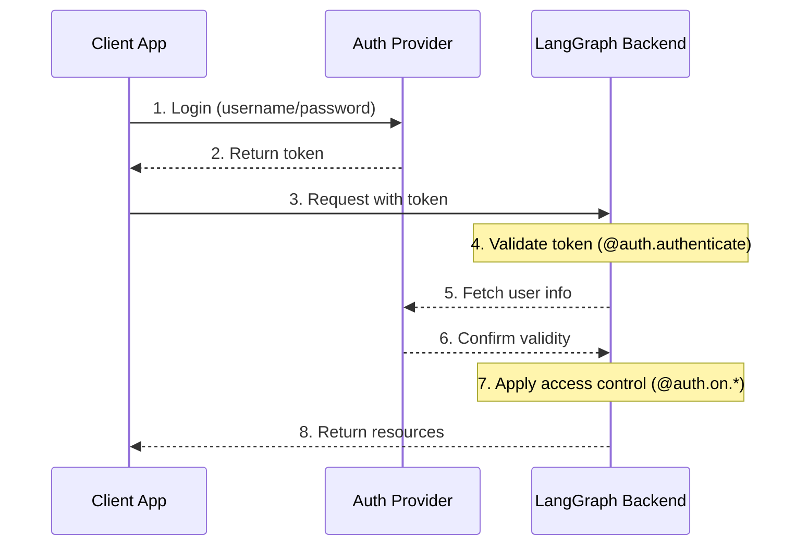
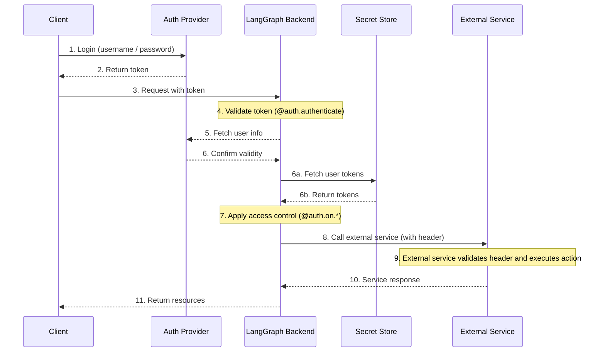

---
search:
  boost: 2
---

# 身份验证和访问控制 (Authentication & Access Control)

LangGraph Platform 提供了一个灵活的身份验证和授权系统，可以与大多数身份验证方案集成。

## 核心概念 (Core Concepts)

### 身份验证 vs 授权 (Authentication vs Authorization)

虽然经常互换使用，但这些术语代表了不同的安全概念：

- [**身份验证**](#authentication) ("AuthN") 验证 *你是谁*。这作为每个请求的中间件运行。
- [**授权**](#authorization) ("AuthZ") 确定 *你能做什么*。这在每个资源的基础上验证用户的特权和角色。

:::python
在 LangGraph Platform 中，身份验证由您的 [`@auth.authenticate`](../cloud/reference/sdk/python_sdk_ref.md#langgraph_sdk.auth.Auth.authenticate) 处理程序处理，而授权由您的 [`@auth.on`](../cloud/reference/sdk/python_sdk_ref.md#langgraph_sdk.auth.Auth.on) 处理程序处理。
:::

:::js
在 LangGraph Platform 中，身份验证由您的 [`@auth.authenticate`](../cloud/reference/sdk/typescript_sdk_ref.md#auth.authenticate) 处理程序处理，而授权由您的 [`@auth.on`](../cloud/reference/sdk/typescript_sdk_ref.md#auth.on) 处理程序处理。
:::

## 默认安全模型 (Default Security Models)

LangGraph Platform 提供不同的安全默认值：

### LangGraph Platform

- 默认使用 LangSmith API 密钥
- 需要 `x-api-key` 标头中的有效 API 密钥
- 可以使用您的 auth 处理程序进行自定义

!!! note "Custom auth"

    LangGraph Platform 中的所有计划 **都支持** 自定义身份验证。

### 自托管 (Self-Hosted)

- 默认没有身份验证
- 完全灵活地实施您的安全模型
- 您控制身份验证和授权的所有方面

## 系统架构 (System Architecture)

典型的身份验证设置涉及三个主要组件：

1. **身份验证提供者** (Identity Provider/IdP)

   - 管理用户身份和凭据的专用服务
   - 处理用户注册、登录、密码重置等
   - 成功身份验证后颁发令牌（JWT、会话令牌等）
   - 示例：Auth0、Supabase Auth、Okta 或您自己的 auth 服务器

2. **LangGraph 后端** (Resource Server)

   - 包含业务逻辑和受保护资源的 LangGraph 应用程序
   - 使用身份验证提供者验证令牌
   - 根据用户身份和权限强制执行访问控制
   - 不直接存储用户凭据

3. **客户端应用程序** (Frontend)

   - Web 应用程序、移动应用程序或 API 客户端
   - 收集时间敏感的用户凭据并发送到身份验证提供者
   - 从身份验证提供者接收令牌
   - 在对 LangGraph 后端的请求中包含这些令牌

以下是这些组件通常如何交互：



:::python
LangGraph 中的 [`@auth.authenticate`](../cloud/reference/sdk/python_sdk_ref.md#langgraph_sdk.auth.Auth.authenticate) 处理程序处理步骤 4-6，而您的 [`@auth.on`](../cloud/reference/sdk/python_sdk_ref.md#langgraph_sdk.auth.Auth.on) 处理程序实现步骤 7。
:::

:::js
LangGraph 中的 [`auth.authenticate`](https://langchain-ai.github.io/langgraph/cloud/reference/sdk/js_ts_sdk_ref/#authenticate) 处理程序处理步骤 4-6，而您的 [`auth.on`](https://langchain-ai.github.io/langgraph/cloud/reference/sdk/js_ts_sdk_ref/#on>) 处理程序实现步骤 7。
:::

## 身份验证 (Authentication)

:::python
LangGraph 中的身份验证作为每个请求的中间件运行。您的 [`@auth.authenticate`](../cloud/reference/sdk/python_sdk_ref.md#langgraph_sdk.auth.Auth.authenticate) 处理程序接收请求信息，并且应该：

1. 验证凭据
2. 如果有效，返回包含用户身份和用户信息的 [用户信息](../cloud/reference/sdk/python_sdk_ref.md#langgraph_sdk.auth.types.MinimalUserDict)
3. 如果无效，引发 [HTTPException](../cloud/reference/sdk/python_sdk_ref.md#langgraph_sdk.auth.exceptions.HTTPException) 或 AssertionError

```python
from langgraph_sdk import Auth

auth = Auth()

@auth.authenticate
async def authenticate(headers: dict) -> Auth.types.MinimalUserDict:
    # Validate credentials (e.g., API key, JWT token)
    api_key = headers.get("x-api-key")
    if not api_key or not is_valid_key(api_key):
        raise Auth.exceptions.HTTPException(
            status_code=401,
            detail="Invalid API key"
        )

    # Return user info - only identity and is_authenticated are required
    # Add any additional fields you need for authorization
    return {
        "identity": "user-123",        # Required: unique user identifier
        "is_authenticated": True,      # Optional: assumed True by default
        "permissions": ["read", "write"] # Optional: for permission-based auth
        # You can add more custom fields if you want to implement other auth patterns
        "role": "admin",
        "org_id": "org-456"

    }
```

返回的用户信息可用：

- 通过 [`ctx.user`](../cloud/reference/sdk/python_sdk_ref.md#langgraph_sdk.auth.types.AuthContext) 提供给您的授权处理程序
- 通过 `config["configuration"]["langgraph_auth_user"]` 在您的应用程序中
  :::

:::js
LangGraph 中的身份验证作为每个请求的中间件运行。您的 [`authenticate`](https://langchain-ai.github.io/langgraph/cloud/reference/sdk/js_ts_sdk_ref/#authenticate>) 处理程序接收请求信息，并且应该：

1. 验证凭据
2. 如果有效，返回包含用户身份和用户信息的 [用户信息]
3. 如果无效，引发 [HTTPException](https://langchain-ai.github.io/langgraph/cloud/reference/sdk/js_ts_sdk_ref/#class-httpexception>)

```typescript
import { Auth, HTTPException } from "@langchain/langgraph-sdk";

export const auth = new Auth();

auth.authenticate(async (request) => {
  // Validate credentials (e.g., API key, JWT token)
  const apiKey = request.headers.get("x-api-key");
  if (!apiKey || !isValidKey(apiKey)) {
    throw new HTTPException(401, "Invalid API key");
  }

  // Return user info - only identity and isAuthenticated are required
  // Add any additional fields you need for authorization
  return {
    identity: "user-123", // Required: unique user identifier
    isAuthenticated: true, // Optional: assumed true by default
    permissions: ["read", "write"], // Optional: for permission-based auth
    // You can add more custom fields if you want to implement other auth patterns
    role: "admin",
    orgId: "org-456",
  };
});
```

返回的用户信息可用：

- 通过 [回调处理程序](https://langchain-ai.github.io/langgraph/cloud/reference/sdk/js_ts_sdk_ref/#on) 中的 `user` 属性提供给您的授权处理程序
- 通过 `config.configurable.langgraph_auth_user` 在您的应用程序中
  :::

??? tip "Supported Parameters"

    :::python
    [`@auth.authenticate`](../cloud/reference/sdk/python_sdk_ref.md#langgraph_sdk.auth.Auth.authenticate) 处理程序可以通过名称接受以下任何参数：

    * request (Request): 原始 ASGI 请求对象
    * body (dict): 解析的请求体
    * path (str): 请求路径，例如，"/threads/abcd-1234-abcd-1234/runs/abcd-1234-abcd-1234/stream"
    * method (str): HTTP 方法，例如，"GET"
    * path_params (dict[str, str]): URL 路径参数，例如，{"thread_id": "abcd-1234-abcd-1234", "run_id": "abcd-1234-abcd-1234"}
    * query_params (dict[str, str]): URL 查询参数，例如，{"stream": "true"}
    * headers (dict[bytes, bytes]): 请求头
    * authorization (str | None): Authorization 头值（例如，"Bearer <token>"）
    :::

    :::js
    [`authenticate`](https://langchain-ai.github.io/langgraph/cloud/reference/sdk/js_ts_sdk_ref/#authenticate) 处理程序可以接受以下任何参数：

    * request (Request): 原始请求对象
    * body (object): 解析的请求体
    * path (string): 请求路径，例如，"/threads/abcd-1234-abcd-1234/runs/abcd-1234-abcd-1234/stream"
    * method (string): HTTP 方法，例如，"GET"
    * pathParams (Record<string, string>): URL 路径参数，例如，{"threadId": "abcd-1234-abcd-1234", "runId": "abcd-1234-abcd-1234"}
    * queryParams (Record<string, string>): URL 查询参数，例如，{"stream": "true"}
    * headers (Record<string, string>): 请求头
    * authorization (string | null): Authorization 头值（例如，"Bearer <token>"）
    :::

    在我们的许多教程中，为了简洁起见，我们只显示“authorization”参数，但您可以选择根据需要接受更多信息以实现您的自定义身份验证方案。

### 代理身份验证 (Agent authentication)

自定义身份验证允许委派访问。您在 `@auth.authenticate` 中返回的值将添加到运行上下文中，从而赋予代理用户范围的凭据，使它们能够代表用户访问资源。



身份验证后，平台会创建一个特殊的配置对象，该对象通过可配置上下文传递给您的图和所有节点。
此对象包含有关当前用户的信息，包括您从 [`@auth.authenticate`](../cloud/reference/sdk/python_sdk_ref.md#langgraph_sdk.auth.Auth.authenticate) 处理程序返回的任何自定义字段。

要使代理能够代表用户行事，请使用 [自定义身份验证中间件](../how-tos/auth/custom_auth.md)。这将允许代理代表用户与 MCP 服务器、外部数据库甚至其他代理等外部系统进行交互。

有关更多信息，请参阅 [使用自定义 auth](../how-tos/auth/custom_auth.md#enable-agent-authentication) 指南。

### MCP 的代理身份验证 (Agent authentication with MCP)

有关如何将代理验证到 MCP 服务器的信息，请参阅 [MCP 概念指南](../concepts/mcp.md)。

## 授权 (Authorization)

身份验证后，LangGraph 调用您的授权处理程序来控制对特定资源（例如，线程、助手、cron）的访问。这些处理程序可以：

1. 通过改变元数据来添加要在资源创建期间保存的元数据。有关每个操作的值可以采用的类型列表，请参阅 [支持的操作表](#supported-actions)。
2. 通过返回 [过滤器](#filter-operations) 在搜索/列出或读取操作期间按元数据过滤资源。
3. 如果访问被拒绝，则引发 HTTP 异常。

如果您只想实施简单的用户范围的访问控制，您可以对所有资源和操作使用单个授权处理程序。如果您想根据资源和操作进行不同的控制，可以使用 [特定于资源的处理程序](#resource-specific-handlers)。有关支持访问控制的资源的完整列表，请参阅 [支持的资源](#supported-resources) 部分。

:::python
您的 [`@auth.on`](../cloud/reference/sdk/python_sdk_ref.md#langgraph_sdk.auth.Auth.on) 处理程序通过直接改变 `value["metadata"]` 字典并返回 [过滤器字典](#filter-operations) 来控制访问。

```python
@auth.on
async def add_owner(
    ctx: Auth.types.AuthContext,
    value: dict  # The payload being sent to this access method
) -> dict:  # Returns a filter dict that restricts access to resources
    """Authorize all access to threads, runs, crons, and assistants.

    This handler does two things:
        - Adds a value to resource metadata (to persist with the resource so it can be filtered later)
        - Returns a filter (to restrict access to existing resources)

    Args:
        ctx: Authentication context containing user info, permissions, the path, and
        value: The request payload sent to the endpoint. For creation
              operations, this contains the resource parameters. For read
              operations, this contains the resource being accessed.

    Returns:
        A filter dictionary that LangGraph uses to restrict access to resources.
        See [Filter Operations](#filter-operations) for supported operators.
    """
    # Create filter to restrict access to just this user's resources
    filters = {"owner": ctx.user.identity}

    # Get or create the metadata dictionary in the payload
    # This is where we store persistent info about the resource
    metadata = value.setdefault("metadata", {})

    # Add owner to metadata - if this is a create or update operation,
    # this information will be saved with the resource
    # So we can filter by it later in read operations
    metadata.update(filters)

    # Return filters to restrict access
    # These filters are applied to ALL operations (create, read, update, search, etc.)
    # to ensure users can only access their own resources
    return filters
```

:::

:::js
您可以通过直接改变 `value.metadata` 对象并在注册 [`on()`](https://langchain-ai.github.io/langgraph/cloud/reference/sdk/js_ts_sdk_ref/#on) 处理程序时返回 [过滤器对象](#filter-operations) 来细粒度地控制访问。

```typescript
import { Auth, HTTPException } from "@langchain/langgraph-sdk/auth";

export const auth = new Auth()
  .authenticate(async (request: Request) => ({
    identity: "user-123",
    permissions: [],
  }))
  .on("*", ({ value, user }) => {
    // Create filter to restrict access to just this user's resources
    const filters = { owner: user.identity };

    // If the operation supports metadata, add the user identity
    // as metadata to the resource.
    if ("metadata" in value) {
      value.metadata ??= {};
      value.metadata.owner = user.identity;
    }

    // Return filters to restrict access
    // These filters are applied to ALL operations (create, read, update, search, etc.)
    // to ensure users can only access their own resources
    return filters;
  });
```

:::

### 特定于资源的处理程序 (Resource-Specific Handlers) {#resource-specific-handlers}

您可以通过使用授权装饰器将资源和操作名称链接在一起来为特定资源和操作注册处理程序。
发出请求时，将调用与该资源和操作匹配的最具体的处理程序。下面是如何为特定资源和操作注册处理程序的示例。对于以下设置：

1. 经过身份验证的用户能够创建线程、读取线程并在线程上创建运行
2. 只有具有“assistants:create”权限的用户才允许创建新助手
3. 所有其他端点（例如，删除助手、crons、store）对所有用户禁用。

!!! tip "Supported Handlers"

    有关支持的资源和操作的完整列表，请参阅下面的 [支持的资源](#supported-resources) 部分。

:::python

```python
# Generic / global handler catches calls that aren't handled by more specific handlers
@auth.on
async def reject_unhandled_requests(ctx: Auth.types.AuthContext, value: Any) -> False:
    print(f"Request to {ctx.path} by {ctx.user.identity}")
    raise Auth.exceptions.HTTPException(
        status_code=403,
        detail="Forbidden"
    )

# Matches the "thread" resource and all actions - create, read, update, delete, search
# Since this is **more specific** than the generic @auth.on handler, it will take precedence
# over the generic handler for all actions on the "threads" resource
@auth.on.threads
async def on_thread_create(
    ctx: Auth.types.AuthContext,
    value: Auth.types.threads.create.value
):
    if "write" not in ctx.permissions:
        raise Auth.exceptions.HTTPException(
            status_code=403,
            detail="User lacks the required permissions."
        )
    # Setting metadata on the thread being created
    # will ensure that the resource contains an "owner" field
    # Then any time a user tries to access this thread or runs within the thread,
    # we can filter by owner
    metadata = value.setdefault("metadata", {})
    metadata["owner"] = ctx.user.identity
    return {"owner": ctx.user.identity}

# Thread creation. This will match only on thread create actions
# Since this is **more specific** than both the generic @auth.on handler and the @auth.on.threads handler,
# it will take precedence for any "create" actions on the "threads" resources
@auth.on.threads.create
async def on_thread_create(
    ctx: Auth.types.AuthContext,
    value: Auth.types.threads.create.value
):
    # Setting metadata on the thread being created
    # will ensure that the resource contains an "owner" field
    # Then any time a user tries to access this thread or runs within the thread,
    # we can filter by owner
    metadata = value.setdefault("metadata", {})
    metadata["owner"] = ctx.user.identity
    return {"owner": ctx.user.identity}

# Reading a thread. Since this is also more specific than the generic @auth.on handler, and the @auth.on.threads handler,
# it will take precedence for any "read" actions on the "threads" resource
@auth.on.threads.read
async def on_thread_read(
    ctx: Auth.types.AuthContext,
    value: Auth.types.threads.read.value
):
    # Since we are reading (and not creating) a thread,
    # we don't need to set metadata. We just need to
    # return a filter to ensure users can only see their own threads
    return {"owner": ctx.user.identity}

# Run creation, streaming, updates, etc.
# This takes precedenceover the generic @auth.on handler and the @auth.on.threads handler
@auth.on.threads.create_run
async def on_run_create(
    ctx: Auth.types.AuthContext,
    value: Auth.types.threads.create_run.value
):
    metadata = value.setdefault("metadata", {})
    metadata["owner"] = ctx.user.identity
    # Inherit thread's access control
    return {"owner": ctx.user.identity}

# Assistant creation
@auth.on.assistants.create
async def on_assistant_create(
    ctx: Auth.types.AuthContext,
    value: Auth.types.assistants.create.value
):
    if "assistants:create" not in ctx.permissions:
        raise Auth.exceptions.HTTPException(
            status_code=403,
            detail="User lacks the required permissions."
        )
```

:::

:::js

```typescript
import { Auth, HTTPException } from "@langchain/langgraph-sdk/auth";

export const auth = new Auth()
  .authenticate(async (request: Request) => ({
    identity: "user-123",
    permissions: ["threads:write", "threads:read"],
  }))
  .on("*", ({ event, user }) => {
    console.log(`Request for ${event} by ${user.identity}`);
    throw new HTTPException(403, { message: "Forbidden" });
  })

  // Matches the "threads" resource and all actions - create, read, update, delete, search
  // Since this is **more specific** than the generic `on("*")` handler, it will take precedence over the generic handler for all actions on the "threads" resource
  .on("threads", ({ permissions, value, user }) => {
    if (!permissions.includes("write")) {
      throw new HTTPException(403, {
        message: "User lacks the required permissions.",
      });
    }

    // Not all events do include `metadata` property in `value`.
    // So we need to add this type guard.
    if ("metadata" in value) {
      value.metadata ??= {};
      value.metadata.owner = user.identity;
    }

    return { owner: user.identity };
  })

  // Thread creation. This will match only on thread create actions.
  // Since this is **more specific** than both the generic `on("*")` handler and the `on("threads")` handler, it will take precedence for any "create" actions on the "threads" resources
  .on("threads:create", ({ value, user, permissions }) => {
    if (!permissions.includes("write")) {
      throw new HTTPException(403, {
        message: "User lacks the required permissions.",
      });
    }

    // Setting metadata on the thread being created will ensure that the resource contains an "owner" field
    // Then any time a user tries to access this thread or runs within the thread,
    // we can filter by owner
    value.metadata ??= {};
    value.metadata.owner = user.identity;

    return { owner: user.identity };
  })

  // Reading a thread. Since this is also more specific than the generic `on("*")` handler, and the `on("threads")` handler,
  .on("threads:read", ({ user }) => {
    // Since we are reading (and not creating) a thread,
    // we don't need to set metadata. We just need to
    // return a filter to ensure users can only see their own threads.
    return { owner: user.identity };
  })

  // Run creation, streaming, updates, etc.
  // This takes precedence over the generic `on("*")` handler and the `on("threads")` handler
  .on("threads:create_run", ({ value, user }) => {
    value.metadata ??= {};
    value.metadata.owner = user.identity;

    return { owner: user.identity };
  })

  // Assistant creation. This will match only on assistant create actions.
  // Since this is **more specific** than both the generic `on("*")` handler and the `on("assistants")` handler, it will take precedence for any "create" actions on the "assistants" resources
  .on("assistants:create", ({ value, user, permissions }) => {
    if (!permissions.includes("assistants:create")) {
      throw new HTTPException(403, {
        message: "User lacks the required permissions.",
      });
    }

    // Setting metadata on the assistant being created will ensure that the resource contains an "owner" field.
    // Then any time a user tries to access this assistant, we can filter by owner
    value.metadata ??= {};
    value.metadata.owner = user.identity;

    return { owner: user.identity };
  });
```

:::

请注意，我们在上面的示例中混合了全局处理程序和特定于资源的处理程序。由于每个请求都由最具体的处理程序处理，因此创建 `thread` 的请求将匹配 `on_thread_create` 处理程序，但不会匹配 `reject_unhandled_requests` 处理程序。但是，`update` 线程的请求将由全局处理程序处理，因为我们没有针对该资源和操作的更具体的处理程序。

### 过滤器操作 (Filter Operations) {#filter-operations}

:::python
授权处理程序可以返回不同类型的值：

- `None` 和 `True` 表示“授权访问所有底层资源”
- `False` 表示“拒绝访问所有底层资源（引发 403 异常）”
- 元数据过滤器字典将限制对资源的访问

过滤器字典是一个与资源元数据匹配的键的字典。它支持三个运算符：

- 默认值是精确匹配的简写，或 "$eq"，如下所示。例如，`{"owner": user_id}` 将仅包括元数据包含 `{"owner": user_id}` 的资源
- `$eq`: 精确匹配（例如，`{"owner": {"$eq": user_id}}`） - 这等同于上面的简写，`{"owner": user_id}`
- `$contains`: 列表成员资格（例如，`{"allowed_users": {"$contains": user_id}}`）。这里的值必须是列表的一个元素。存储资源中的元数据必须是列表/容器类型。

包含多个键的字典使用逻辑 `AND` 过滤器处理。例如，`{"owner": org_id, "allowed_users": {"$contains": user_id}}` 将仅匹配其“owner”为 `org_id` 且其“allowed_users”列表包含 `user_id` 的资源。
有关更多信息，请参阅此处参考 [这里](../cloud/reference/sdk/python_sdk_ref.md#langgraph_sdk.auth.types.FilterType)。
:::

:::js
授权处理程序可以返回不同类型的值：

- `null` 和 `true` 表示“授权访问所有底层资源”
- `false` 表示“拒绝访问所有底层资源（引发 403 异常）”
- 元数据过滤器对象将限制对资源的访问

过滤器对象是一个与资源元数据匹配的键的对象。它支持三个运算符：

- 默认值是精确匹配的简写，或 "$eq"，如下所示。例如，`{ owner: userId}` 将仅包括元数据包含 `{ owner: userId }` 的资源
- `$eq`: 精确匹配（例如，`{ owner: { $eq: userId } }`） - 这等同于上面的简写，`{ owner: userId }`
- `$contains`: 列表成员资格（例如，`{ allowedUsers: { $contains: userId} }`）。这里的值必须是列表的一个元素。存储资源中的元数据必须是列表/容器类型。

包含多个键的对象使用逻辑 `AND` 过滤器处理。例如，`{ owner: orgId, allowedUsers: { $contains: userId} }` 将仅匹配其“owner”为 `orgId` 且其“allowedUsers”列表包含 `userId` 的资源。
有关更多信息，请参阅此处参考 [这里](../cloud/reference/sdk/typescript_sdk_ref.md#auth.types.FilterType)。
:::

## 常见的访问模式 (Common Access Patterns)

以下是一些典型的授权模式：

### 单一所有者资源 (Single-Owner Resources)

这种常见的模式允许您将所有线程、助手、cron 和运行范围限定为单个用户。这对于像常规聊天机器人风格应用程序那样的常见单用户用例非常有用。

:::python

```python
@auth.on
async def owner_only(ctx: Auth.types.AuthContext, value: dict):
    metadata = value.setdefault("metadata", {})
    metadata["owner"] = ctx.user.identity
    return {"owner": ctx.user.identity}
```

:::

:::js

```typescript
export const auth = new Auth()
  .authenticate(async (request: Request) => ({
    identity: "user-123",
    permissions: ["threads:write", "threads:read"],
  }))
  .on("*", ({ value, user }) => {
    if ("metadata" in value) {
      value.metadata ??= {};
      value.metadata.owner = user.identity;
    }
    return { owner: user.identity };
  });
```

:::

### 基于权限的访问 (Permission-based Access)

此模式允许您根据 **权限** 控制访问。如果您希望某些角色具有对资源的更广泛或更受限制的访问权限，这很有用。

:::python

```python
# In your auth handler:
@auth.authenticate
async def authenticate(headers: dict) -> Auth.types.MinimalUserDict:
    ...
    return {
        "identity": "user-123",
        "is_authenticated": True,
        "permissions": ["threads:write", "threads:read"]  # Define permissions in auth
    }

def _default(ctx: Auth.types.AuthContext, value: dict):
    metadata = value.setdefault("metadata", {})
    metadata["owner"] = ctx.user.identity
    return {"owner": ctx.user.identity}

@auth.on.threads.create
async def create_thread(ctx: Auth.types.AuthContext, value: dict):
    if "threads:write" not in ctx.permissions:
        raise Auth.exceptions.HTTPException(
            status_code=403,
            detail="Unauthorized"
        )
    return _default(ctx, value)


@auth.on.threads.read
async def rbac_create(ctx: Auth.types.AuthContext, value: dict):
    if "threads:read" not in ctx.permissions and "threads:write" not in ctx.permissions:
        raise Auth.exceptions.HTTPException(
            status_code=403,
            detail="Unauthorized"
        )
    return _default(ctx, value)
```

:::

:::js

```typescript
import { Auth, HTTPException } from "@langchain/langgraph-sdk/auth";

export const auth = new Auth()
  .authenticate(async (request: Request) => ({
    identity: "user-123",
    // Define permissions in auth
    permissions: ["threads:write", "threads:read"],
  }))
  .on("threads:create", ({ value, user, permissions }) => {
    if (!permissions.includes("threads:write")) {
      throw new HTTPException(403, { message: "Unauthorized" });
    }

    if ("metadata" in value) {
      value.metadata ??= {};
      value.metadata.owner = user.identity;
    }
    return { owner: user.identity };
  })
  .on("threads:read", ({ user, permissions }) => {
    if (
      !permissions.includes("threads:read") &&
      !permissions.includes("threads:write")
    ) {
      throw new HTTPException(403, { message: "Unauthorized" });
    }

    return { owner: user.identity };
  });
```

:::

## 支持的资源 (Supported Resources)

LangGraph 提供三个级别的授权处理程序，从最一般到最具体：

:::python

1. **全局处理程序** (`@auth.on`): 匹配所有资源和操作
2. **资源处理程序** (例如，`@auth.on.threads`, `@auth.on.assistants`, `@auth.on.crons`): 匹配特定资源的所有操作
3. **操作处理程序** (例如，`@auth.on.threads.create`, `@auth.on.threads.read`): 匹配特定资源上的特定操作

将使用最具体的匹配处理程序。例如，对于线程创建，`@auth.on.threads.create` 优先于 `@auth.on.threads`。
如果注册了更具体的处理程序，则不会为该资源和操作调用更通用的处理程序。
:::

:::js

1. **全局处理程序** (`on("*")`): 匹配所有资源和操作
2. **资源处理程序** (例如，`on("threads")`, `on("assistants")`, `on("crons")`): 匹配特定资源的所有操作
3. **操作处理程序** (例如，`on("threads:create")`, `on("threads:read")`): 匹配特定资源上的特定操作

将使用最具体的匹配处理程序。例如，对于线程创建，`on("threads:create")` 优先于 `on("threads")`。
如果注册了更具体的处理程序，则不会为该资源和操作调用更通用的处理程序。
:::

:::python
???+ tip "Type Safety"
    每个处理程序都有其 `value` 参数的可用类型提示。例如：

    ```python
    @auth.on.threads.create
    async def on_thread_create(
        ctx: Auth.types.AuthContext,
        value: Auth.types.on.threads.create.value  # Specific type for thread creation
    ):
        ...

    @auth.on.threads
    async def on_threads(
        ctx: Auth.types.AuthContext,
        value: Auth.types.on.threads.value  # Union type of all thread actions
    ):
        ...

    @auth.on
    async def on_all(
        ctx: Auth.types.AuthContext,
        value: dict  # Union type of all possible actions
    ):
        ...
    ```

    更具体的处理程序提供更好的类型提示，因为它们处理的操作类型更少。

:::

#### 支持的操作和类型 (Supported actions and types) {#supported-actions}

以下是所有支持的操作处理程序：

:::python
| 资源 (Resource) | 处理程序 (Handler) | 描述 (Description) | 值类型 (Value Type) |
|----------|---------|-------------|------------|
| **Threads** | `@auth.on.threads.create` | Thread creation | [`ThreadsCreate`](../cloud/reference/sdk/python_sdk_ref.md#langgraph_sdk.auth.types.ThreadsCreate) |
| | `@auth.on.threads.read` | Thread retrieval | [`ThreadsRead`](../cloud/reference/sdk/python_sdk_ref.md#langgraph_sdk.auth.types.ThreadsRead) |
| | `@auth.on.threads.update` | Thread updates | [`ThreadsUpdate`](../cloud/reference/sdk/python_sdk_ref.md#langgraph_sdk.auth.types.ThreadsUpdate) |
| | `@auth.on.threads.delete` | Thread deletion | [`ThreadsDelete`](../cloud/reference/sdk/python_sdk_ref.md#langgraph_sdk.auth.types.ThreadsDelete) |
| | `@auth.on.threads.search` | Listing threads | [`ThreadsSearch`](../cloud/reference/sdk/python_sdk_ref.md#langgraph_sdk.auth.types.ThreadsSearch) |
| | `@auth.on.threads.create_run` | Creating or updating a run | [`RunsCreate`](../cloud/reference/sdk/python_sdk_ref.md#langgraph_sdk.auth.types.RunsCreate) |
| **Assistants** | `@auth.on.assistants.create` | Assistant creation | [`AssistantsCreate`](../cloud/reference/sdk/python_sdk_ref.md#langgraph_sdk.auth.types.AssistantsCreate) |
| | `@auth.on.assistants.read` | Assistant retrieval | [`AssistantsRead`](../cloud/reference/sdk/python_sdk_ref.md#langgraph_sdk.auth.types.AssistantsRead) |
| | `@auth.on.assistants.update` | Assistant updates | [`AssistantsUpdate`](../cloud/reference/sdk/python_sdk_ref.md#langgraph_sdk.auth.types.AssistantsUpdate) |
| | `@auth.on.assistants.delete` | Assistant deletion | [`AssistantsDelete`](../cloud/reference/sdk/python_sdk_ref.md#langgraph_sdk.auth.types.AssistantsDelete) |
| | `@auth.on.assistants.search` | Listing assistants | [`AssistantsSearch`](../cloud/reference/sdk/python_sdk_ref.md#langgraph_sdk.auth.types.AssistantsSearch) |
| **Crons** | `@auth.on.crons.create` | Cron job creation | [`CronsCreate`](../cloud/reference/sdk/python_sdk_ref.md#langgraph_sdk.auth.types.CronsCreate) |
| | `@auth.on.crons.read` | Cron job retrieval | [`CronsRead`](../cloud/reference/sdk/python_sdk_ref.md#langgraph_sdk.auth.types.CronsRead) |
| | `@auth.on.crons.update` | Cron job updates | [`CronsUpdate`](../cloud/reference/sdk/python_sdk_ref.md#langgraph_sdk.auth.types.CronsUpdate) |
| | `@auth.on.crons.delete` | Cron job deletion | [`CronsDelete`](../cloud/reference/sdk/python_sdk_ref.md#langgraph_sdk.auth.types.CronsDelete) |
| | `@auth.on.crons.search` | Listing cron jobs | [`CronsSearch`](../cloud/reference/sdk/python_sdk_ref.md#langgraph_sdk.auth.types.CronsSearch) |
:::

:::js
| 资源 (Resource) | 事件 (Event) | 描述 (Description) | 值类型 (Value Type) |
| -------------- | -------------------- | -------------------------- | ------------------------------------------------------------------------------------------------------------------ |
| **Threads** | `threads:create` | Thread creation | [`ThreadsCreate`](https://langchain-ai.github.io/langgraph/cloud/reference/sdk/js_ts_sdk_ref/#threadscreate) |
| | `threads:read` | Thread retrieval | [`ThreadsRead`](https://langchain-ai.github.io/langgraph/cloud/reference/sdk/js_ts_sdk_ref/#threadsread) |
| | `threads:update` | Thread updates | [`ThreadsUpdate`](https://langchain-ai.github.io/langgraph/cloud/reference/sdk/js_ts_sdk_ref/#threadsupdate) |
| | `threads:delete` | Thread deletion | [`ThreadsDelete`](https://langchain-ai.github.io/langgraph/cloud/reference/sdk/js_ts_sdk_ref/#threadsdelete) |
| | `threads:search` | Listing threads | [`ThreadsSearch`](https://langchain-ai.github.io/langgraph/cloud/reference/sdk/js_ts_sdk_ref/#threadssearch) |
| | `threads:create_run` | Creating or updating a run | [`RunsCreate`](https://langchain-ai.github.io/langgraph/cloud/reference/sdk/js_ts_sdk_ref/#threadscreate_run) |
| **Assistants** | `assistants:create` | Assistant creation | [`AssistantsCreate`](https://langchain-ai.github.io/langgraph/cloud/reference/sdk/js_ts_sdk_ref/#assistantscreate) |
| | `assistants:read` | Assistant retrieval | [`AssistantsRead`](https://langchain-ai.github.io/langgraph/cloud/reference/sdk/js_ts_sdk_ref/#assistantsread) |
| | `assistants:update` | Assistant updates | [`AssistantsUpdate`](https://langchain-ai.github.io/langgraph/cloud/reference/sdk/js_ts_sdk_ref/#assistantsupdate) |
| | `assistants:delete` | Assistant deletion | [`AssistantsDelete`](https://langchain-ai.github.io/langgraph/cloud/reference/sdk/js_ts_sdk_ref/#assistantsdelete) |
| | `assistants:search` | Listing assistants | [`AssistantsSearch`](https://langchain-ai.github.io/langgraph/cloud/reference/sdk/js_ts_sdk_ref/#assistantssearch) |
| **Crons** | `crons:create` | Cron job creation | [`CronsCreate`](https://langchain-ai.github.io/langgraph/cloud/reference/sdk/js_ts_sdk_ref/#cronscreate) |
| | `crons:read` | Cron job retrieval | [`CronsRead`](https://langchain-ai.github.io/langgraph/cloud/reference/sdk/js_ts_sdk_ref/#cronsread) |
| | `crons:update` | Cron job updates | [`CronsUpdate`](https://langchain-ai.github.io/langgraph/cloud/reference/sdk/js_ts_sdk_ref/#cronsupdate) |
| | `crons:delete` | Cron job deletion | [`CronsDelete`](https://langchain-ai.github.io/langgraph/cloud/reference/sdk/js_ts_sdk_ref/#cronsdelete) |
| | `crons:search` | Listing cron jobs | [`CronsSearch`](https://langchain-ai.github.io/langgraph/cloud/reference/sdk/js_ts_sdk_ref/#cronssearch) |
:::

???+ note "About Runs"

    运行的访问控制范围限定于其父线程。这意味着权限通常继承自线程，反映了数据模型的对话性质。除了创建之外，所有运行操作（读取、列出）都由线程的处理程序控制。

    :::python
    有一个特定的 `create_run` 处理程序用于创建新运行，因为它具有更多您可以在处理程序中查看的参数。
    :::

    :::js
    有一个特定的 `threads:create_run` 处理程序用于创建新运行，因为它具有更多您可以在处理程序中查看的参数。
    :::
